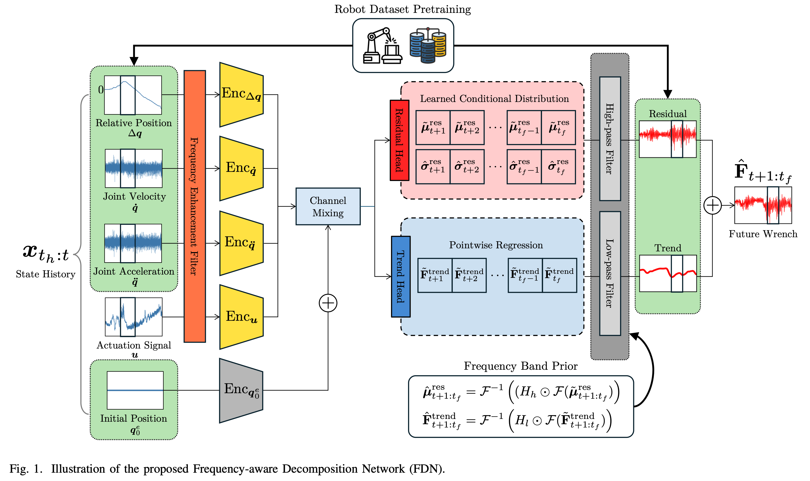
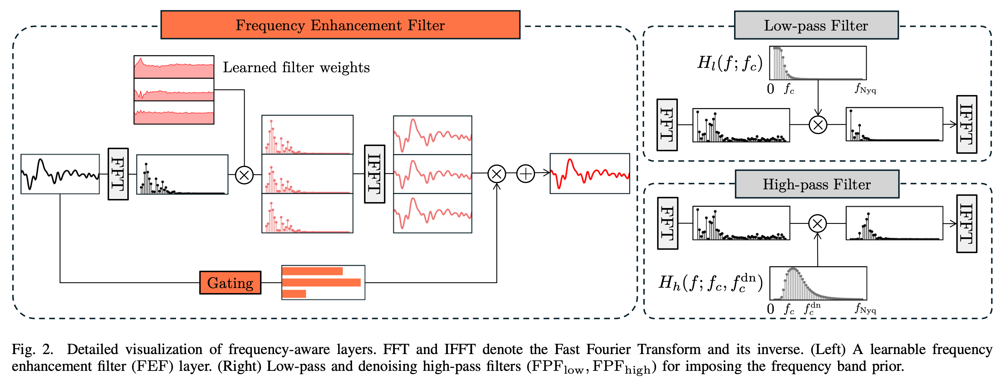
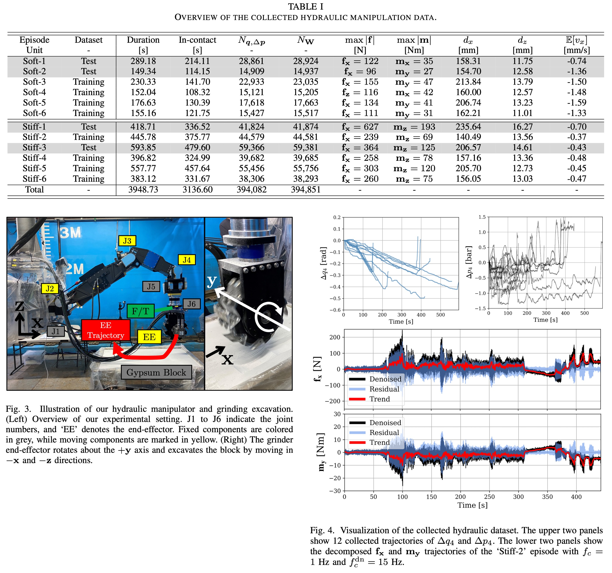
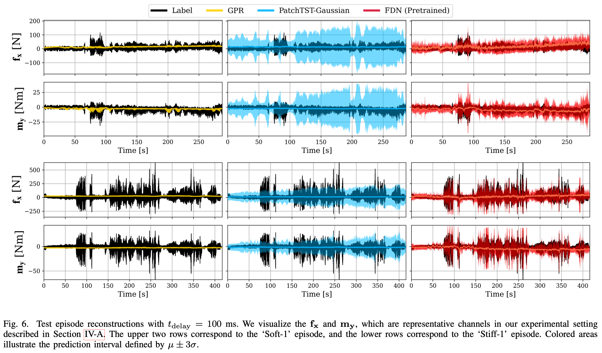
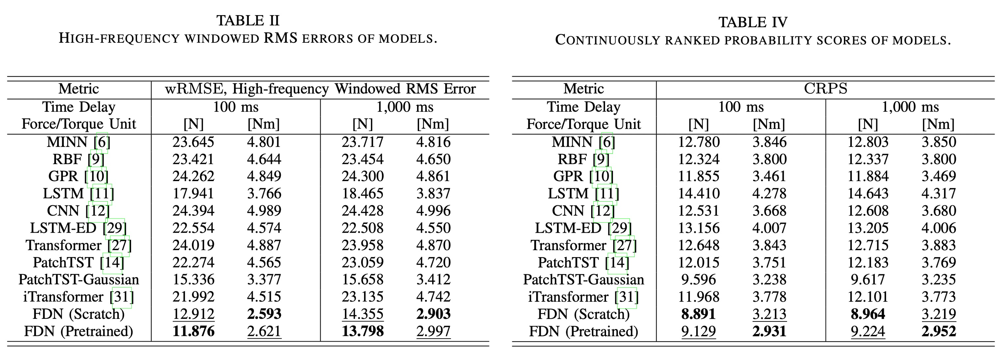
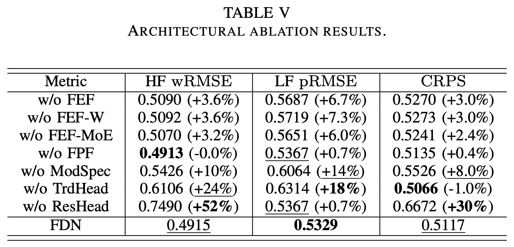
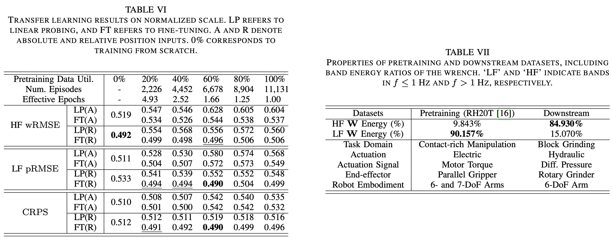

# Frequency-aware Decomposition Network (FDN)
### Official code and data of [Frequency-aware Decomposition Learning for Sensorless Wrench Forecasting on a Vibration-rich Hydraulic Manipulator](https://arxiv.org/abs/2604.12905).

## Code and data will be made available upon acceptance.

## Research highlights

1. #### Proposes a learning-based, sensorless wrench forecasting method for contact- and vibration-rich robotic interactions.
2. #### Captures high-frequency contact transients and local peaks of the interaction wrench through decomposition-based probabilistic modeling and frequency-aware architectures.
3. #### Enhances performance via transfer learning from a large-scale open-source robot dataset to the domain-specific hydraulic manipulation setting.

## Key designs

- **Decomposition-based probabilistic modeling** decomposes wrench signal into low-frequency trend and high-frequency residual, and models the trend with pointwise regression and the residual with conditional distribution.
- **Proprioception-to-wrench transfer learning** transfers learned representation from an open source contact-rich robot dataset to the downstream hydraulic manipulation setting.



- **Frequency-awareness** enforces frequency band prior to the outputs and enhances input spectra with learnable filters.




## Results

We collect data from 12 hydraulic grinding manipulations as follows:



Our FDN model accurately forecasts contact- and vibration-rich wrench signals without physical F/T sensors, as shown in the right panels.




FDN is especially superior in the high-frequency band accuracy, thereby achieving the best full-band score (CRPS).




Ablation studies further demonstrate the effectiveness of each architectural component of FDN.




Transfer learning from the RH20T dataset further improves generalization, despite heterogeneous task, embodiment, and actuation settings between the two datasets.




## Getting started

### Download datasets

We share **preprocessed** datasets only, which can be readily used in the training. We're currently unable to open our raw dataset.
You may check the preprocessing codes from:

```bash
FDN/
┣ data/
┃ ┣ data_hydraulic/
┃ ┣ data_rh20t/
┃ ┣ **process_data_hydraulic.py**
┃ ┗ **process_data_rh20t.py**
...
```

1. Download ```*.tar.gz``` files and move them to the top project directory.

- Dataset 1 (Downstream, Hydraulic) [[Download](https://drive.google.com/file/d/1cPKuLgqUAb1w4DTARSn1m3l1UL39fOoM/view?usp=sharing)] 
- Dataset 2 (Pretraining, [RH20T](https://rh20t.github.io/)) [[Download](https://drive.google.com/file/d/1F1Sj8DzJuwPCnJ95lbXLKjEUvj7414BJ/view?usp=sharing)]

Your project directory should look like:
```bash
FDN/
┣ analysis/
┣ data/
┣ exp/
┣ layers/
┣ models/
┣ utils/
┣ .gitignore
┣ README.md
┣ **data_hydraulic_processed.tar.gz**
┣ **data_rh20t_processed_260216.tar.gz**
┗ requirements.txt
```

2. Untar files using:

```bash
tar -xvf data_hydraulic_processed.tar.gz
tar -xvf data_rh20t_processed_260216.tar.gz
```

3. Install requirements in your environment. We use ```python==3.10``` and ```torch==2.6.0+cu118```.
```
pip install -r requirements.txt --extra-index-url https://download.pytorch.org/whl/cu118
```
We also support the use of the MPS backend on macOS devices. In such cases, install requirements using:
```
pip install -r requirements_mps.txt
```

### Train the models
You may reproduce the training results provided in our paper as follows. While training, you can monitor the training process using [TensorBoard](https://www.tensorflow.org/tensorboard) by ```tensorboard --logdir exp/runs```. 

Our code always runs 3 training runs in parallel. If this causes issues on your machine, consider decreasing the default ```--num_parallel_runs``` in ```exp/helper.py```.

#### 1. Run all FDN numerical experiments

```bash
# This includes training from scratch, pretraining & fine-tuning,
# ablation studies, transfer learning analyses, and additional sensitivity analyses.
bash exp/scripts/run_exp_FDN.sh
```

#### 2. Train baselines
```bash
# This includes all Point2Point, Seq2Point, Seq2Seq baselines.
bash exp/scripts/run_exp_Baselines.sh
```

By default, the training results are stored at ```exp/runs``` directory. Checkpoints are saved every epoch as:
```python
# exp/trainer.py
class Trainer
    def _save_checkpoint(self, fname: str):
        model_instance = get_model(self.model)
        torch.save(
            {   
                # model state_dict
                "state_dict": self._copy_state_dict(model_instance.state_dict()),
                # model configuration parameters
                "configs": deepcopy(self.configs),
                # input/output normalization stats
                "scale_params": deepcopy(self.dataset_train.scale_params),
                # optimizer state_dict
                "optimizer": self._copy_state_dict(self.optimizer.state_dict()),
            },
            fname,
        )
```
You can use the checkpoint items as:
```python
# See lines 170- of analysis/evaluate_models.py
ckpt = torch.load(ckpt_path, map_location="cpu", weights_only=False)
configs = ckpt["configs"]
state_dict = ckpt["state_dict"]
scale_params = ckpt["scale_params"]
model = model_cls.Model(configs)
model.load_state_dict(state_dict)
```


### Evaluate the trained models

After training, running below will generate ```exp/eval_*.txt``` and visualization files.
```bash
python analysis/evaluate_models.py
```
See function ```evaluate_predictions``` in ```analysis/evaluate_models.py``` to check our evaluation logic.

## Acknowledgements

We appreciate valuable inspirations from the projects below:

- [RH20T: A Comprehensive Robotic Dataset for Learning Diverse Skills in One-Shot (ICRA 2024)
](https://rh20t.github.io/)
- [REASSEMBLE: A Multimodal Dataset for Contact-rich Robotic Assembly and Disassembly (RSS 2025)](https://tuwien-asl.github.io/REASSEMBLE_page/)
- [PatchTST: A Time Series is Worth 64 Words: Long-term Forecasting with Transformers. (ICLR 2023)](https://github.com/yuqinie98/patchtst)
- [FEDformer: Frequency Enhanced Decomposed Transformer for Long-term Series Forecasting (ICML 2022)](https://github.com/maziqing/fedformer)
- [iTransformer: Inverted Transformers Are Effective for Time Series Forecasting (ICLR 2024)](https://github.com/thuml/iTransformer)

## Contact

If you have any concerns or additional requests, please feel free to contact [lhbsharp@khu.ac.kr](mailto:lhbsharp@khu.ac.kr) or [leehyeonbeen@vt.edu](leehyeonbeen@vt.edu). You may also create issues in this repo.

## Citation
If you find our work useful, please consider citing our paper:
```
@article{lee2026frequency,
  title={Frequency-aware Decomposition Learning for Sensorless Wrench Forecasting on a Vibration-rich Hydraulic Manipulator},
  author={Lee, Hyeonbeen and Jung, Min-Jae and Yeu, Tae-Kyeong and Han, Jong-Boo and Park, Daegil and Kim, Jin-Gyun},
  journal={arXiv preprint arXiv:2604.12905},
  year={2026}
}
```

