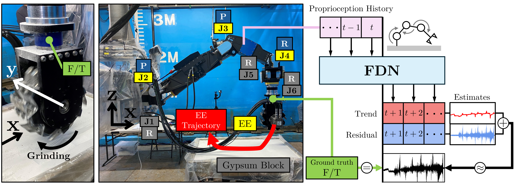
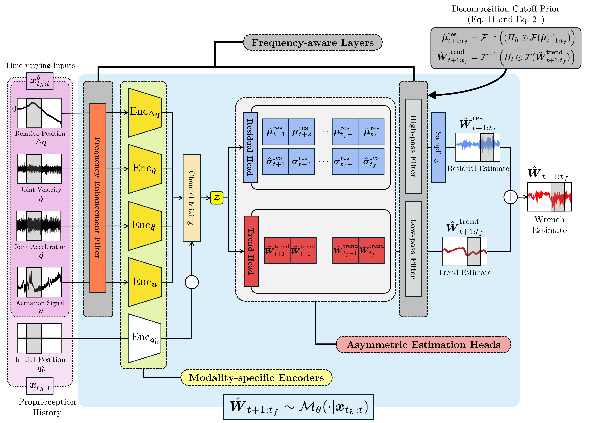
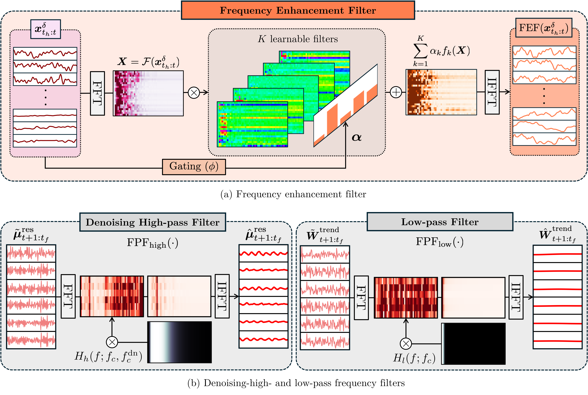
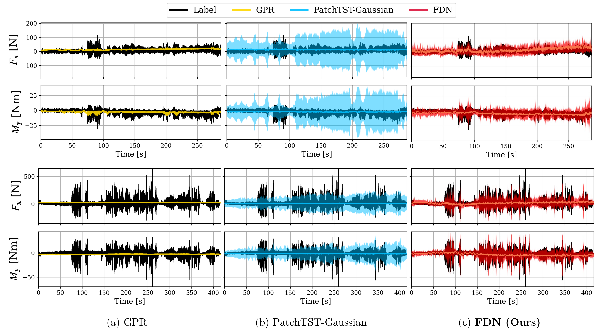
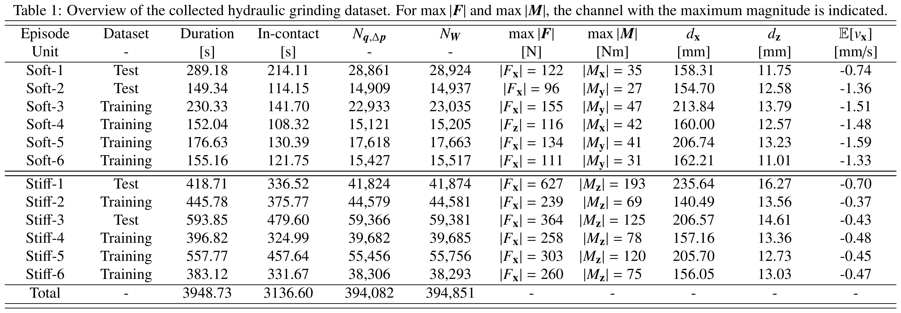
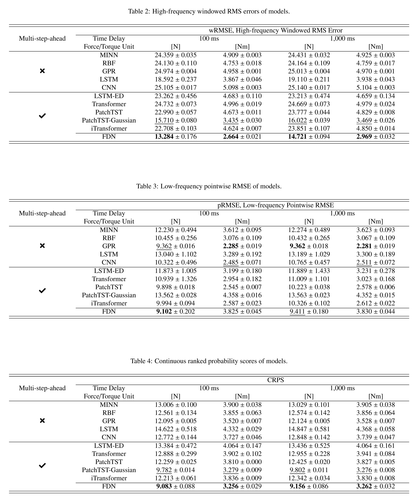
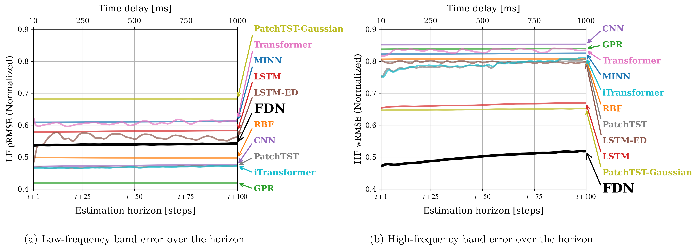

# FDN: Frequency-aware Decomposition Network

[](https://doi.org/10.48550/arXiv.2604.12905)
[](https://doi.org/10.5281/zenodo.23026020)
[](LICENSE)
[](https://hits.sh/github.com/leehyeonbeen/FDN/)

Official implementation of [**Frequency-aware decomposition learning for sensorless wrench estimation in vibration-rich robotic contact**](https://doi.org/10.48550/arXiv.2604.12905).

Hyeonbeen Lee, Min-Jae Jung, Tae-Kyeong Yeu, Jong-Boo Han, Daegil Park, Simon Stepputtis, Jin-Gyun Kim

> [!IMPORTANT]
**Under review.** This repository accompanies a manuscript currently under review. The repository may be updated during the review process.

## Research highlights

1. We propose a learning-based **sensorless, multi-step-ahead wrench estimator** for vibration-rich robotic contact. It does not require an identified robot dynamics model, operates without an F/T sensor once trained, and its estimate remains valid under time delays up to the prediction horizon.
2. **Decomposition-based asymmetric band modeling.** The wrench horizon is decomposed into a low-frequency trend and a high-frequency residual, modeled by pointwise regression and a learned conditional distribution, respectively. **Frequency-aware layers** impose the decomposition cutoff as a band prior on the outputs and adaptively modulate the frequency amplitudes of the input proprioception history.
3. On real-world grinding with a 6-DoF hydraulic manipulator, FDN:
   - reduces high-frequency amplitude error by up to **47%** compared with the baselines under assumed time delays;
   - maintains competitive overall low-frequency pointwise accuracy;
   - estimates a **1,000 ms horizon within 11 ms** on a single CPU thread.
4. Transferring wrench dynamics learned from [RH20T](https://rh20t.github.io) further reduces low-frequency error by **8%**.

<p align="center"></p>

> **Figure 1.** Our grinding task and FDN.
> - **Setup.** J1 to J6 are the joint numbers, and "EE" is the end-effector. Cylinder drive types are revolute (R) or prismatic (P). The robot grinds a gypsum block along the $-x$ and $-z$ directions.
> - **FDN.** From a proprioception history, FDN produces decomposed (trend and residual) wrench estimates over a prediction horizon. It is trained with the ground truth from a wrist F/T sensor.

## Key designs

FDN treats the low-frequency wrench as a **deterministic trend** and the high-frequency vibration as a **stochastic residual**, and estimates both over a multi-step-ahead horizon.

<p align="center"></p>

> **Figure 2.** The Frequency-aware Decomposition Network (FDN). FDN takes a proprioception history as input and estimates the decomposed wrench over the prediction horizon in a single forward pass.

- **Asymmetric estimation heads.** The wrench horizon is decomposed at 1 Hz into a trend, estimated by pointwise regression (trend head), and a residual, estimated as a conditional Gaussian distribution (residual head). Their sum is the final estimate at each step.
- **Modality-specific encoders.** Each input modality (relative joint positions, velocities, accelerations, actuation signals, and the initial position) has its own encoder. Separating the initial position from relative joint positions improves transferability.

<p align="center"></p>

> **Figure 3.** Frequency-aware layers. (a) The frequency enhancement filter (FEF). (b) The denoising high-pass and low-pass frequency pass filters (FPF).

- **Frequency pass filters (FPF)** restrict the trend and residual estimates to the same bands as their ground truths (decomposition cutoff 1 Hz, denoising cutoff 15 Hz).
- **Frequency enhancement filter (FEF)** adaptively reweights the spectral magnitudes of the input history with an input-gated mixture of learnable filters, while preserving phase.

## Results

<p align="center"></p>

> **Figure 6.** Test episode reconstructions of $F_\mathbf{x}$ and $M_\mathbf{y}$ ('Soft-1' top, 'Stiff-1' bottom) with $t_{\text{delay}} = 100$ ms for (a) GPR, (b) PatchTST-Gaussian, and (c) FDN. Colored areas show $\mu \pm 3\sigma$. GPR misses high-frequency vibrations, and PatchTST-Gaussian misses contact transients, while FDN captures both the peaks and the low-frequency trend.

We evaluate on 12 teleoperated grinding episodes from two sessions (Soft/Stiff). Two episodes per session are held out for testing.

<p align="center"></p>

> **Table 1.** Overview of the collected hydraulic grinding data. Softer blocks are ground rapidly in the 'Soft' session and stiffer blocks slowly in the 'Stiff' session, which results in distinct wrench distributions across sessions.

**Evaluation protocol.** We assume a constant time delay $t_{\text{delay}}$ and reconstruct each test episode from single prediction points:
- **Point estimators** are compared with the ground truth at $t + t_{\text{delay}}$, i.e., as delayed zero-order-hold estimates.
- **Multi-step-ahead (sequence) estimators** contribute the $t + t_{\text{delay}}$ step of each output sequence, i.e., their estimates remain valid after the delay.

**Metrics.** The reconstructed episodes are decomposed at $f_c = 1$ Hz.
- **wRMSE:** RMSE of windowed RMS values of the high-frequency residual (0.1 s windows), which measures transient amplitude fidelity.
- **pRMSE:** pointwise RMSE of the low-frequency trend.
- **CRPS:** full-band continuous ranked probability score.

<p align="center"></p>

> **Tables 2–4.** High-frequency wRMSE, low-frequency pRMSE, and CRPS under time delays of 100 ms and 1,000 ms (mean ± std over 3 runs). FDN reduces wRMSE by 8% to 47% compared with the baselines, keeps competitive overall pRMSE, and achieves the lowest CRPS.

<p align="center"></p>

> **Figure 7.** (a) Low-frequency pRMSE and (b) high-frequency wRMSE at every horizon step from $t+1$ to $t+100$. Error levels and model rankings are maintained over the entire horizon, so multi-step-ahead estimation does not sacrifice accuracy, and FDN outperforms the baselines in the high-frequency band at every step.

## Getting started

### Installation

We use `python==3.10` and `torch==2.6.0+cu118`.

```bash
pip install -r requirements_cuda.txt --extra-index-url https://download.pytorch.org/whl/cu118
# or, on macOS (MPS)
pip install -r requirements_mps.txt
```
We recommend using CUDA or CPU for exact reproduction. MPS may occasionally yield inaccurate results.

### Data and checkpoints

We provide all the checkpoints used to produce the results in our paper, together with preprocessed datasets that can be used for training directly.

#### [**Download the released data and checkpoints from Zenodo:**](https://doi.org/10.5281/zenodo.23026020)

- **Checkpoints.** All trained models (`checkpoints.tar.part_*`, 3.2 GB).
- **Hydraulic grinding dataset.** 12 teleoperated grinding episodes (about 66 min) with a 6-DoF hydraulic manipulator, recorded at 100 Hz (`data_hydraulic.tar`, 370 MB).
- **[RH20T](https://rh20t.github.io/).** Pre-processed, used for the transfer learning study (`data_rh20t.tar.part_*`, 15.0 GB).

Move the downloaded files to the project root and run:

```bash
cat checkpoints.tar.part_* > checkpoints.tar
cat data_rh20t.tar.part_* > data_rh20t.tar

tar -xvf checkpoints.tar
tar -xvf data_hydraulic.tar
tar -xvf data_rh20t.tar
```

We only provide the preprocessed data. The preprocessing scripts are provided in `data/process_data_hydraulic.py` and `data/process_data_rh20t.py`.

### Running a trained FDN

A checkpoint stores the model `state_dict`, the training `configs`, and the normalization statistics `scale_params`. The example below runs FDN on test samples from the project root:

```python
import torch
from torch.utils.data import DataLoader
from data.dataset import HydraulicDatasetRelPos6D, CollateDecompose
from models import FDN_PatchTST_RelPos6D

ckpt = torch.load("exp/runs_v1/FromScratch/260320-1255_FDN_PatchTST_RelPos6D_c1b4f3de/E5.pt", map_location="cpu", weights_only=False)
configs, scale_params = ckpt["configs"], ckpt["scale_params"] # training configuration, normalization statistics
model = FDN_PatchTST_RelPos6D.Model(configs) # retrieve model skeleton
model.load_state_dict(ckpt["state_dict"]) # load trained parameters
model.eval()

# configs.seq_len = L = 100 (input history)
# configs.pred_len = T = 100 (prediction horizon)
# select either 'train' or 'test' split
dataset = HydraulicDatasetRelPos6D(configs.seq_len, configs.pred_len, "test", scale_params=scale_params)
# let the dataset normalize data using scale_params
dataset.scale()
# obtain normalized input (B,L,5n=30) and output (B,T,6) labels
x, w, w_trend, w_res, channel_mask = next(iter(DataLoader(dataset, batch_size=8, collate_fn=CollateDecompose())))

with torch.inference_mode():
    # obtain four (B,T,6) wrench estimates
    # trend, sampled residual, residual mean, and log-variance
    trend, res, mu, logvar = model(x, channel_mask=channel_mask)
    # sum trend and residual, and revert to the original scale
    wrench = (trend + res) * scale_params["std_o"] + scale_params["mean_o"]
```

### Code and paper names

Some names in the code differ from the paper:

| Paper | Code |
|:--|:--|
| FDN (relative positions, 6-DoF) | `models/FDN_PatchTST_RelPos6D.py` |
| FDN for transfer learning, relative (R) / absolute (A) positions | `models/FDN_PatchTST_RelPos7D.py` / `models/FDN_PatchTST_AbsPos7D.py` |
| Frequency enhancement filter (FEF) / frequency pass filters (FPF) | `FreqEnhanceFilter` / `FreqPassFilter` in `layers/Filter.py` |
| Encoders of $\Delta\boldsymbol{q}$, $\dot{\boldsymbol{q}}$, $\ddot{\boldsymbol{q}}$, $\boldsymbol{u}$, $\boldsymbol{q}^e_0$ | `encoder_jointpos`, `encoder_jointvel`, `encoder_jointacc`, `encoder_jtorque`, `encoder_jointpos_0` |
| Trend head / residual head | `decoder.linear_trend` / `decoder.linear_mu`, `decoder.linear_logvar` |
| Actuation signal $\boldsymbol{u}$ (joint differential pressure) | `jtorque` |
| w/o TrdHead / w/o ResHead (Table 5) | `Ablation_DetHead` (`--disable_dethead`) / `Ablation_ProbHead` (`--disable_probhead`) |
| w/o ModSpec (Table 5) | `Ablation_ModSpecEnc` (`models/FDN_PatchTST_RelPos6D_ModShared.py`) |
| Channel / Time / Time-Channel correlation (Table 7) | `FromScratch_MVNChannel` / `FromScratch_MVNTemporal` / `FromScratch_MVNKron` |
| LSTM-ED / Transformer | `LSTMEncDec` / `TransformerEncDec` |

### Evaluation

With the released checkpoints, the majority of the tables and figures in the paper can be reproduced directly with the commands below. Tables are saved to `results/tableN.txt`. Figures are saved to `analysis/visualize_data/fef_figure_plots/` (Fig. 3), `analysis/episode_recon_all/` (Fig. 6), `analysis/horizon_errors/` (Fig. 7), and `analysis/visualize_data/` (Figs. 4, 5, 8–10).

`analysis/evaluate_models.py` runs the trained models, while `analysis/visualize_data.py` analyzes the data only. For reference, `table2-4` takes about 20 minutes on an Apple M5 Max (128 GB, macOS 26.7 Tahoe).

- **Your own runs.** Training saves runs to `exp/runs/`. To evaluate them, move `exp/runs/<experiment>` to `exp/runs_v1/` (Tables 2–5, 8, 9, Figs. 3, 6, 7) or `exp/runs_v2/` (Tables 6, 7).

```bash
python analysis/evaluate_models.py table2-4   # Tables 2-4: baselines at 100 / 1,000 ms delays
python analysis/evaluate_models.py table5     # Table 5: architectural ablations
python analysis/evaluate_models.py table6     # Table 6: input ablations
python analysis/evaluate_models.py table7     # Table 7: residual correlation
python analysis/evaluate_models.py table8     # Table 8: inference time
python analysis/evaluate_models.py table9     # Table 9: transfer learning
python analysis/evaluate_models.py fig3       # Fig. 3: frequency-aware layers (from a trained FDN)
python analysis/evaluate_models.py fig6       # Fig. 6: test episode reconstructions
python analysis/evaluate_models.py fig7       # Fig. 7: band-specific errors over the horizon

python analysis/visualize_data.py table1      # Table 1: hydraulic dataset overview
python analysis/visualize_data.py fig4        # Fig. 4: proprioceptive states and decomposed wrench
python analysis/visualize_data.py fig5        # Fig. 5: power spectrum of the training wrench, (a) raw and (b) denoised
python analysis/visualize_data.py fig8        # Fig. 8: marginal distributions of the residuals
python analysis/visualize_data.py fig9        # Fig. 9: correlation analysis of the residuals
python analysis/visualize_data.py fig10       # Fig. 10: power spectra of RH20T and the hydraulic dataset
python analysis/visualize_data.py table10     # Table 10: band energy ratios of the datasets
```

In the text outputs, `HF RMS-RMSE`, `LF RMSE`, and `CRPS` correspond to wRMSE, pRMSE, and CRPS in the paper. `(N, Nm, All)` gives the force, torque, and all-channel values.

### Training the models

Run all commands from the project root.

```bash
# FDN, ablation studies, residual correlation study, and transfer learning
bash exp/scripts/run_exp_FDN.sh

# Baselines: MINN, RBF, GPR, LSTM, CNN, LSTM-ED, Transformer, PatchTST, PatchTST-Gaussian, iTransformer
bash exp/scripts/run_exp_Baselines.sh
```

- **Runs and output.** Each script trains 3 runs (seeds 0–2) and saves them to `exp/runs/<experiment>/`. The comments in the two shell scripts show which script produces which table, so you can also run a single experiment.
- **Number of runs.** Set how many times each configuration is trained, each with a different seed, with `--itr` (default 3), e.g. `python exp/scripts/fdn_relpos/exp_scratch_FDN_RelPos6D.py --itr 1`.
- **Transfer learning from the released checkpoints.** Move `exp/runs_v1/RelPos7D_Pretrain` (or `AbsPos7D_Pretrain`) to `exp/runs/` before running linear probing or fine-tuning.
- **Parallel runs.** Runs are executed in parallel. Lower `--num_parallel_runs` (default 3) if your machine runs out of memory, e.g., `--num_parallel_runs 1`.
- **Training time.** One FDN run takes about 14 minutes on a single NVIDIA Tesla V100.
- **TensorBoard Monitoring.** `tensorboard --logdir exp/runs`
- **Configuration.** Default hyperparameters are defined in `exp/helper.py`.

## License

Please note that the code and the dataset are released under separate licenses.

The [code in this GitHub repository](https://github.com/leehyeonbeen/FDN) is released under the [MIT License](https://opensource.org/license/mit),  which allows reuse with attribution.

The [dataset on Zenodo](https://doi.org/10.5281/zenodo.23026020) is released under the [CC BY-NC-SA 4.0 License](https://creativecommons.org/licenses/by-nc-sa/4.0/deed.en), which allows non-commercial reuse with attribution under the same license. [RH20T](https://rh20t.github.io)-derived data included in our dataset remain subject to its original license.

## Acknowledgements

We appreciate the following projects, which inspired this work:

- [RH20T: A comprehensive robotic dataset for learning diverse skills in one-shot (ICRA 2024)](https://rh20t.github.io/)
- [A time series is worth 64 words: Long-term forecasting with transformers (ICLR 2023)](https://github.com/yuqinie98/patchtst)
- [FEDformer: Frequency enhanced decomposed transformer for long-term series forecasting (ICML 2022)](https://github.com/maziqing/fedformer)
- [iTransformer: Inverted transformers are effective for time series forecasting (ICLR 2024)](https://github.com/thuml/iTransformer)


## Contact
If you have any concerns or additional requests, please feel free to contact **Hyeonbeen Lee ([leehyeonbeen@vt.edu](mailto:leehyeonbeen@vt.edu))**, or open issues in this repo.

## Citation
```
@article{lee2026frequency,
  title={Frequency-aware decomposition learning for sensorless wrench estimation in vibration-rich robotic contact},
  author={Lee, Hyeonbeen and Jung, Min-Jae and Yeu, Tae-Kyeong and Han, Jong-Boo and Park, Daegil and Stepputtis, Simon and Kim, Jin-Gyun},
  journal={arXiv preprint arXiv:2604.12905},
  year={2026}
}
```
